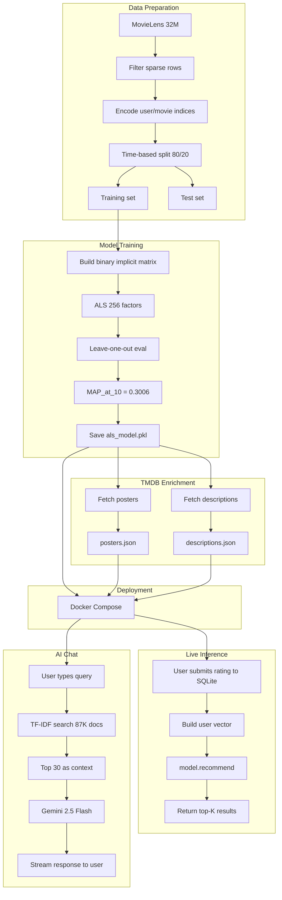
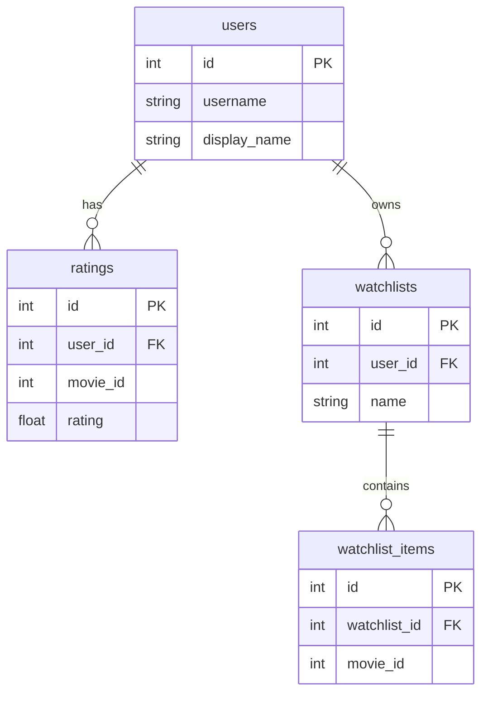
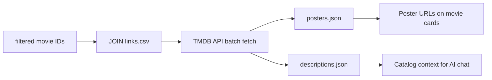
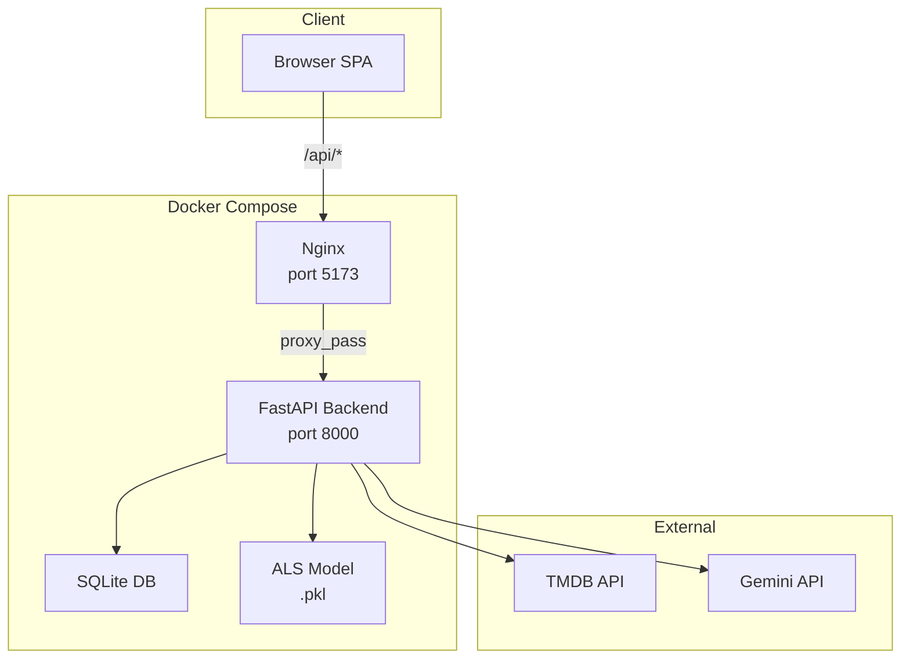

# CineMatch — Big Data Analysis Report

## 1. Dataset Overview

### Source: MovieLens 32M

The [MovieLens 32M](https://grouplens.org/datasets/movielens/32m/) dataset contains 32 million movie ratings collected from the MovieLens website. It is one of the largest publicly available recommender-system datasets.

| File | Rows | Columns | Description |
|------|------|---------|-------------|
| `ratings.csv` | 32,000,204 | `userId`, `movieId`, `rating`, `timestamp` | Explicit ratings 0.5–5.0 (half-star increments) |
| `movies.csv` | 87,585 | `movieId`, `title`, `genres` | Movies with pipe-separated genre labels |
| `tags.csv` | 2,000,072 | `userId`, `movieId`, `tag`, `timestamp` | User-generated tags |
| `links.csv` | 87,585 | `movieId`, `imdbId`, `tmdbId` | External ID mappings (IMDb, TMDB) |

### Data Characteristics

**Sparsity**: With 32M ratings across 200K users and 87K movies, the user-item matrix is ~99.8% sparse. This is typical for collaborative filtering — most users have rated only a tiny fraction of available movies.

**Rating distribution**: Ratings are left-skewed, with the majority falling between 3.0 and 5.0. Very few ratings below 2.0 exist, which is characteristic of implicit-feedback datasets where observed interactions imply positive preference.

**Temporal range**: Ratings span from 1995 to 2019, covering 24 years of movie-watching behavior.

---

## 2. Data Pipeline

### Filtering

Users and movies with sparse interaction records are removed to reduce noise and improve model quality:

- **min_user_ratings = 20**: Remove users with fewer than 20 ratings
- **min_movie_ratings = 50**: Remove movies with fewer than 50 ratings

After filtering: **~31.5M ratings**, **200,947 users**, **16,034 movies** — 98.4% of ratings retained while eliminating tail noise.

### Train/Test Split

A time-based split preserves temporal ordering:

```
All ratings sorted by timestamp
├── 80% → Training set (earliest)
└── 20% → Test set (most recent)
```

This simulates real-world deployment: predict what a user will watch *next* based on what they've watched *before*.

### Full Workflow



**Key insight**: The model is trained once offline on MovieLens 32M and never retrained. New user ratings affect recommendations at inference time (temporary user vector) but don't update the underlying item factors. This is a deliberate tradeoff — batch retraining would need to be added for real-time personalization.

---

## 3. SQL Database

### Schema Design

The live application uses SQLite for persistent storage of users, ratings, and watchlists:

```sql
CREATE TABLE users (
    id INTEGER PRIMARY KEY AUTOINCREMENT,
    username TEXT UNIQUE NOT NULL,
    display_name TEXT DEFAULT '',
    created_at TEXT DEFAULT (datetime('now'))
);

CREATE TABLE ratings (
    id INTEGER PRIMARY KEY AUTOINCREMENT,
    user_id INTEGER NOT NULL REFERENCES users(id),
    movie_id INTEGER NOT NULL,
    rating REAL NOT NULL CHECK (rating >= 0.5 AND rating <= 5.0),
    created_at TEXT DEFAULT (datetime('now'))
);

CREATE TABLE watchlists (
    id INTEGER PRIMARY KEY AUTOINCREMENT,
    user_id INTEGER NOT NULL REFERENCES users(id),
    name TEXT NOT NULL
);

CREATE TABLE watchlist_items (
    id INTEGER PRIMARY KEY AUTOINCREMENT,
    watchlist_id INTEGER NOT NULL REFERENCES watchlists(id) ON DELETE CASCADE,
    movie_id INTEGER NOT NULL,
    UNIQUE(watchlist_id, movie_id)
);
```

### Indexing Strategy

Indexes are created on foreign-key columns to accelerate JOIN operations:

```sql
CREATE INDEX idx_ratings_user ON ratings(user_id);
CREATE INDEX idx_ratings_movie ON ratings(movie_id);
CREATE INDEX idx_watchlists_user ON watchlists(user_id);
CREATE INDEX idx_watchlist_items_wl ON watchlist_items(watchlist_id);
```

### Entity-Relationship Diagram



### Key SQL Operations

**User history fetch** (used to build recommendation vectors):

```sql
SELECT movie_id, rating FROM ratings WHERE user_id = ? ORDER BY created_at DESC;
```

**Ratings with movie metadata** (profile page display):

```sql
SELECT r.movie_id, r.rating, r.created_at, m.title, m.genres
FROM ratings r
JOIN movies m ON r.movie_id = m.movieId
WHERE r.user_id = ? ORDER BY r.created_at DESC;
```

**Watchlist items with movie data**:

```sql
SELECT wi.movie_id, wi.added_at
FROM watchlist_items wi
JOIN watchlists w ON wi.watchlist_id = w.id
WHERE w.id = ? ORDER BY wi.added_at DESC;
```

**Auto-create user** (idempotent upsert):

```python
conn.execute(
    "INSERT OR IGNORE INTO users (id, username, display_name) VALUES (?, ?, ?)",
    (user_id, f"user_{user_id}", f"User {user_id}"),
)
```

---

## 4. Recommendation Model: ALS

### Algorithm

The model uses **Alternating Least Squares (ALS)** with implicit feedback, implemented in the [`implicit`](https://implicit.readthedocs.io/) library.

**Matrix factorization objective**: Factorize the user-item interaction matrix *R* (size *U × M*) into two low-rank matrices:
- *X* (size *U × f*): user factors
- *Y* (size *M × f*): item factors

Where *f* is the number of latent factors (embedding dimension), such that:

> *R ≈ X · Yᵀ*

The ALS algorithm alternates between fixing *Y* and solving for *X*, and vice versa, until convergence. Each sub-problem is a weighted least-squares regression that can be solved in closed form.

### Implicit Feedback Formulation

Instead of using raw ratings (0.5–5.0), we convert to binary implicit feedback:

> **preference *pᵤᵢ* = 1 if rating ≥ 4.0, else 0**

The confidence matrix *C* gives higher weight to observed interactions:

> *cᵤᵢ* = 1 + α * rᵤᵢ*

Where *α* is the confidence scaling factor and *rᵤᵢ* is the original rating. This formulation (Hu, Koren, Volinsky 2008) treats unobserved interactions as negative with low confidence, rather than assuming all unrated items are negative.

### Hyperparameter Grid Search

| Parameter | Values Tested | Description |
|-----------|--------------|-------------|
| Factors (*f*) | 64, 128, 256 | Number of latent dimensions |
| Regularization (λ) | 0.01, 0.05, 0.1 | L2 regularization strength |
| Alpha (α) | 20, 40, 80 | Confidence scaling |

All models trained for 20 iterations.

### Best Configuration

| Parameter | Value |
|-----------|-------|
| Factors | 256 |
| Regularization | 0.1 |
| Alpha | 20 |
| Iterations | 20 |
| Rating threshold | ≥ 4.0 (binary like) |

### Evaluation Protocol

We use **leave-one-out** evaluation: for each user in a held-out set of 5,000 users, one rated item is hidden, and the model ranks all unrated items. If the hidden item appears in the top-*k* recommendations, it counts as a hit.

### Results

| Metric | Value |
|--------|-------|
| Precision@10 | 0.0541 |
| Recall@10 | 0.5408 |
| MAP@10 | **0.3006** |

**Analysis**: The high Recall@10 relative to Precision@10 is expected for implicit-feedback recommenders — users typically have many more liked items than can be ranked in the top 10. MAP@10 of 0.30 means the held-out item appears, on average, within the first ~3 positions when it is present in the top 10.

### Cold-Start Handling

For new users with no ratings, the system falls back to popularity-based recommendations. This is handled by passing an empty user vector to the model, which returns the highest-scored items across all users (global popularity).

---

## 5. Features

### Personalized Recommendations

For a returning user *u*, the model computes a user vector *xᵤ* from their rating history, then scores every item *i* as:

> *scoreᵤᵢ = xᵤ · yᵢ*

The top-*k* items with the highest scores (excluding already-rated items) are returned.

### Similar Movies (Item-Item)

Given a movie *i*, similar items are found by computing cosine similarity between its factor vector *yᵢ* and all other item vectors, then returning the *n* most similar.

### Group Mode

For multiple users, ratings are merged by averaging per-movie scores:

```python
merged = [(movie_id, mean(ratings)) for movie_id in all_user_ratings]
```

This creates a single group preference vector, which is then passed to the standard recommendation pipeline.

### AI Chat (LLM Integration)

TMDB descriptions are keyword-matched against the user's query, and the top 30 matching movies are injected into a Gemini 2.5 Flash prompt as catalog context. The LLM recommends 3–5 movies and explains why they fit, grounding its response in the actual catalog rather than generating hallucinated titles.

### TMDB Enrichment Pipeline



The batch fetch processes ~20 requests/second to stay within TMDB's rate limit (40 req/10s). Results are cached as JSON and loaded at application startup. A `--retry-failed` flag allows re-fetching only null/empty entries after network issues.

---

## 6. System Architecture



**Request flow**:
1. Browser loads SPA from Nginx
2. API calls go through `/api/` prefix, proxied to FastAPI
3. Backend queries SQLite for user/watchlist data
4. Backend loads ALS model from pickle file for recommendations
5. AI chat queries Gemini API with catalog context from `descriptions.json`

### Deployment

- **Docker Compose** orchestrates backend + frontend containers
- **Cloudflare Tunnel** provides HTTPS without open ports
- **Host mounts** keep model, data, and database visible to containers
- **`.env`** (gitignored) holds API keys

---

## 7. References

- Hu, Y., Koren, Y., & Volinsky, C. (2008). *Collaborative Filtering for Implicit Feedback Datasets*. IEEE ICDM.
- Harper, F. M., & Konstan, J. A. (2016). *The MovieLens Datasets: History and Context*. ACM Transactions on Interactive Intelligent Systems.
- implicit library: https://github.com/benfred/implicit
- FastAPI: https://fastapi.tiangolo.com/
